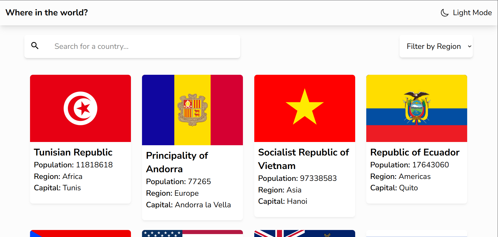

# Frontend Mentor - REST Countries API with color theme switcher solution

This is a solution to the [REST Countries API with color theme switcher challenge on Frontend Mentor](https://www.frontendmentor.io/challenges/rest-countries-api-with-color-theme-switcher-5cacc469fec04111f7b848ca). Frontend Mentor challenges help you improve your coding skills by building realistic projects.

## Overview

### Screenshot

### Links

- Solution URL: [Github](https://github.com/siyam-eng/countries-api-react.git)
- Live Site URL: [Github Pages](https://siyam-eng.github.io/countries-api-react)

## My process

### Built with

- React + Vite
- Tailwind CSS
- REST Countries API

### What I learned

1. Routing with react router - I've implemented routing for the first time in any personal project with React.
2. Adding dark mode toggling with Tailwind
3. Calling APIs from react with useEffect and also making custom hooks for the API calls
4. Improved state management skills

Overall, I enjoyed a lot while building the project apart from learning all these new skills. It's an amazing project to practice front end!

## Author

- Website - [Siyam Ahmed](https://siyamahmed.com)
- Frontend Mentor - [@Siyam1888](https://www.frontendmentor.io/profile/Siyam1888)
- Twitter - [@siyam_88](https://www.twitter.com/siyam_88)
